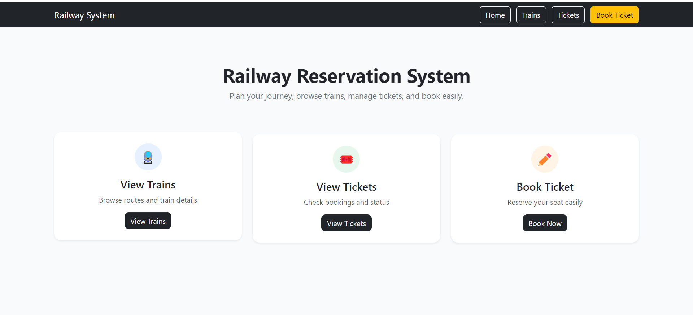
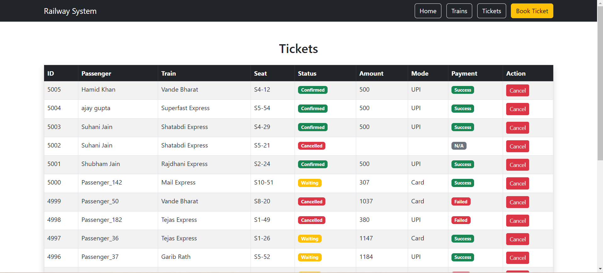
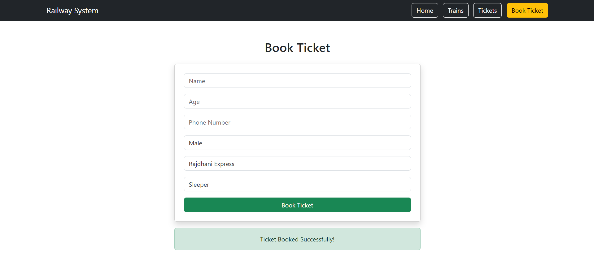

# 🚆 Railway Reservation System

A web-based Railway Reservation System built using **PHP, MySQL, and Bootstrap**.
This project allows users to view trains, book tickets, manage bookings, and handle payments — all through a clean and user-friendly interface.

---

## ✨ Features

* 🚆 View available trains and routes
* 🎟️ Book tickets with passenger details
* 📋 View all tickets with status (Confirmed / Waiting / Cancelled)
* 💳 Payment integration (Success / Failed tracking)
* ❌ Cancel tickets
* 📊 Clean UI with Bootstrap styling

---

## 🛠️ Tech Stack

* **Frontend:** HTML, CSS, Bootstrap
* **Backend:** PHP
* **Database:** MySQL
* **Server:** XAMPP

---

## 📸 Screenshots

### 🏠 Home Page



### 🚆 Train List


### 🎟️ Tickets Page



### ➕ Book Ticket



---

## ⚙️ How to Run Locally

1. Install XAMPP

2. Copy project folder to:

   ```
   C:\xampp\htdocs\
   ```

3. Start:

   * Apache
   * MySQL

4. Open phpMyAdmin:

   ```
   http://localhost/phpmyadmin
   ```

5. Create database:

   ```
   railway_project
   ```

6. Import:

   ```
   railway_project.sql
   ```

7. Run project:

   ```
   http://localhost/dbms_project/
   ```

---

## ⚠️ Configuration Note

In `db.php`, ensure correct MySQL port:

```
3306 OR 3307
```

---

## 📂 Project Structure

```
dbms_project/
│── index.php
│── book.php
│── tickets.php
│── trains.php
│── cancel.php
│── db.php
│── navbar.php
│── railway_project.sql
│── images/
```

---

## 👨‍💻 Developed By

* Your Name
* Team Member 1
* Team Member 2

---

## 🎯 Project Objective

To demonstrate the integration of **database management with web development**, including:

* CRUD operations
* Table relationships (Passenger, Ticket, Train, Payment)
* SQL queries with JOINs
* Real-world booking workflow

---

## ⭐ Future Improvements

* Login system
* Admin dashboard
* Search & filter tickets
* Online payment gateway

---

## 📌 Conclusion

This project successfully demonstrates a complete Railway Reservation System with proper database design and web integration, making it suitable for academic and practical use.

---
